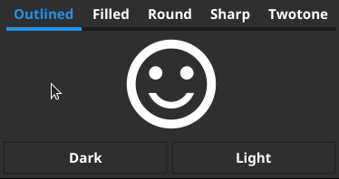

# Fynematic

Fynematic is a simple CLI tool that automates the generation of [Material Icons v4.0.0](https://fonts.google.com/icons) for the [Fyne](https://fyne.io/) toolkit. 

The generated icons are compatible with the dark and light themes.

## Example



See the [example](/example) folder for an example application.

## Installation

```
go get github.com/lucor/fynematics
```

## Usage

```
Usage:
  -category string
    	icon category. Allowed categories: [action alert av communication content device editor file hardware home image maps navigation notification places search social toggle] (default "action")
  -dir string
    	output folder (default ".")
  -name string
    	icon name. See https://fonts.google.com/icons for the full list (default "info")
  -package string
    	package to use in header (default "main")
  -style string
    	icon style. Allowed styles: [outlined filled round sharp twotone] (default "outlined")
```

## Credits

- [Material Icons](https://github.com/google/material-design-icons) released under the [Apache License 2.0 license](https://github.com/google/material-design-icons/blob/4.0.0/LICENSE)
